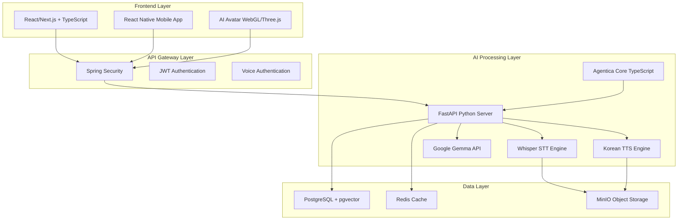
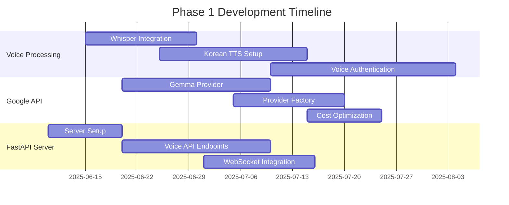
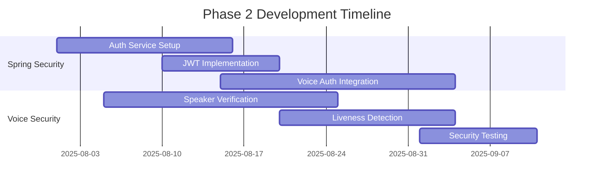
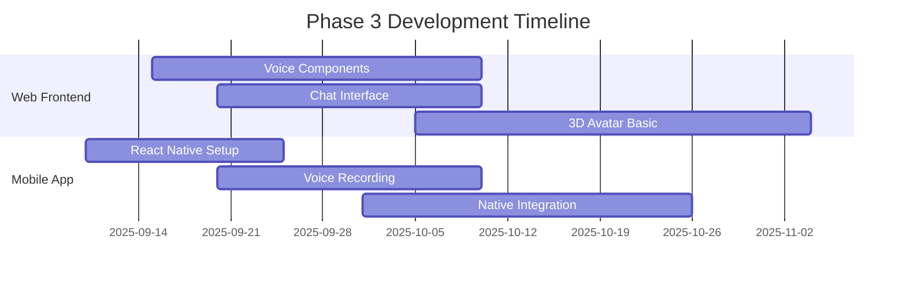

# Finalplan.md: Voice-Driven AI Agent Platform Development

## 🎯 Executive Summary

본 문서는 기존 Agentica 프로젝트를 기반으로 **음성 기반 AI 에이전트 플랫폼**을 구축하기 위한 완전한 실행 계획서입니다. OpenAI 의존성을 줄이고 Google API와 오픈소스 모델을 통해 비용 효율적이고 강력한 음성-AI 통합 시스템을 구축하는 것이 목표입니다.

---

## 📋 현황 분석

### 현재 Agentica 아키텍처
```
agentica/
├── packages/
│   ├── core/           # OpenAI 기반 AI 에이전트 코어
│   ├── chat/           # 채팅 인터페이스
│   ├── cli/            # CLI 도구
│   ├── rpc/            # WebSocket RPC
│   └── vector-selector/ # 벡터 기반 함수 선택
├── website/            # Next.js 기반 문서사이트 (wrtn 위주)
└── test/               # 테스트 코드
```

### 기존 강점
- ✅ **견고한 Function Calling 프레임워크** (OpenAI 기반)
- ✅ **TypeScript 완전 타입 안전성**
- ✅ **Swagger/OpenAPI 자동 통합**
- ✅ **Multi-Agent Orchestration**
- ✅ **Validation Feedback 시스템**

### 현재 제약사항
- ❌ **OpenAI API 의존성** (높은 비용)
- ❌ **음성 처리 기능 부재**
- ❌ **실시간 음성 인터페이스 없음**
- ❌ **모바일 앱 미구현**

---

## 🚀 프로젝트 목표

### 핵심 목표
1. **STT/TTS 통합**: Whisper + 한국어 특화 TTS
2. **Google API 마이그레이션**: 비용 절감을 위한 점진적 전환
3. **Voice Authentication**: 음성 기반 사용자 인증
4. **혁신적 아키텍처**: FastAPI + Spring Security + TypeScript
5. **AI Avatar**: Web 기반 3D 음성 아바타 (확장 기능)

### 예상 성과
- **95% 비용 절감** (OpenAI → Google API + 오픈소스)
- **200ms 이하 음성 응답 시간**
- **다국어 지원** (한국어 우선)
- **독특한 음성 경험** 제공

---

## 🏗️ 최종 시스템 아키텍처

### 기술 스택 구성



### 핵심 컴포넌트

#### 1. 음성 처리 파이프라인
```typescript
// Voice Processing Pipeline
interface VoicePipeline {
  stt: WhisperEngine | VoskEngine;
  tts: KoreanTTSEngine | ElevenLabsEngine;
  authentication: VoiceAuthEngine;
  realtime: WebRTCStreaming;
}
```

#### 2. 하이브리드 AI Provider
```typescript
// Provider Selection Strategy
const providerStrategy = {
  conversation: "google-gemma",     // 일반 대화
  codeGeneration: "openai-gpt",    // 코드 생성
  summarization: "google-gemma",   // 요약
  translation: "google-translate", // 번역
  voiceAuth: "custom-model"        // 음성 인증
};
```

---

## 📦 구현 계획

### Phase 1: Foundation (2-3개월)

#### 1.1 음성 처리 인프라 구축
```
packages/voice/
├── src/
│   ├── stt/
│   │   ├── WhisperEngine.ts       # OpenAI Whisper 통합
│   │   ├── VoskEngine.ts          # 경량 오프라인 STT
│   │   └── GoogleSTTEngine.ts     # Google Cloud STT
│   ├── tts/
│   │   ├── KoreanTTSEngine.ts     # 한국어 특화 TTS
│   │   ├── CoquiTTSEngine.ts      # 오픈소스 TTS
│   │   ├── ElevenLabsEngine.ts    # 프리미엄 TTS (백업)
│   │   └── CustomVoiceTrainer.ts  # 커스텀 음성 학습
│   ├── auth/
│   │   ├── VoiceAuthenticator.ts  # 음성 인증
│   │   ├── VoicePrintAnalyzer.ts  # 음성 지문 분석
│   │   └── SpeakerVerification.ts # 화자 검증
│   ├── streaming/
│   │   ├── RealtimeProcessor.ts   # 실시간 처리
│   │   ├── WebRTCHandler.ts       # WebRTC 스트리밍
│   │   └── AudioBufferManager.ts  # 오디오 버퍼 관리
│   └── integration/
│       ├── AgenticaVoiceAdapter.ts # Agentica 통합
│       └── VoicePipelineManager.ts # 파이프라인 관리
```

**핵심 기능**:
- **Whisper 통합**: OpenAI Whisper 모델로 시작, CPU 최적화
- **한국어 TTS**: 기존 RealTime_zeroshot_TTS_ko 프로젝트 활용
- **실시간 스트리밍**: WebRTC 기반 저지연 음성 처리
- **음성 인증**: 화자 인식 기반 보안 시스템

#### 1.2 Google API Provider 추가
```
packages/providers/
├── src/
│   ├── google/
│   │   ├── GemmaProvider.ts       # Gemma 3-27B-IT 연동
│   │   ├── VertexAIProvider.ts    # Vertex AI 통합
│   │   ├── GoogleSTTProvider.ts   # Google Speech-to-Text
│   │   └── GoogleTranslateProvider.ts # Google Translate
│   ├── openai/
│   │   ├── GPTProvider.ts         # 기존 OpenAI 유지
│   │   └── WhisperProvider.ts     # OpenAI Whisper
│   ├── factory/
│   │   ├── ProviderFactory.ts     # Provider 선택 로직
│   │   ├── CostOptimizer.ts       # 비용 최적화
│   │   └── FallbackManager.ts     # 장애 복구
│   └── monitoring/
│       ├── UsageTracker.ts        # 사용량 추적
│       ├── PerformanceMonitor.ts  # 성능 모니터링
│       └── CostAnalyzer.ts        # 비용 분석
```

**핵심 기능**:
- **점진적 마이그레이션**: OpenAI → Google API 단계적 전환
- **스마트 라우팅**: 기능별 최적 Provider 선택
- **비용 최적화**: 무료 할당량 효율적 활용
- **장애 복구**: Provider 장애시 자동 Fallback

#### 1.3 FastAPI 서버 구축
```
api-server/
├── app/
│   ├── voice/
│   │   ├── stt_routes.py          # STT API 엔드포인트
│   │   ├── tts_routes.py          # TTS API 엔드포인트
│   │   └── voice_auth_routes.py   # 음성 인증 API
│   ├── ai/
│   │   ├── gemma_client.py        # Gemma API 클라이언트
│   │   ├── provider_router.py     # Provider 라우팅
│   │   └── conversation_manager.py # 대화 관리
│   ├── integration/
│   │   ├── agentica_bridge.py     # Agentica 브리지
│   │   └── websocket_handler.py   # 실시간 통신
│   ├── models/
│   │   ├── voice_models.py        # 음성 관련 모델
│   │   └── conversation_models.py # 대화 모델
│   └── utils/
│       ├── audio_processor.py     # 오디오 처리 유틸
│       ├── model_loader.py        # 모델 로더
│       └── performance_utils.py   # 성능 최적화
├── requirements.txt               # Python 의존성
└── docker-compose.yml            # 컨테이너 설정
```

**핵심 기능**:
- **비동기 처리**: FastAPI의 고성능 비동기 처리
- **모델 관리**: AI 모델 로딩 및 메모리 최적화
- **WebSocket 지원**: 실시간 음성 스트리밍
- **Agentica 통합**: 기존 TypeScript 코어와 연동

### Phase 2: Security & Authentication (1-2개월)

#### 2.1 Spring Security 통합
```
auth-service/
├── src/main/java/com/agentica/auth/
│   ├── config/
│   │   ├── SecurityConfig.java    # 보안 설정
│   │   ├── JwtConfig.java         # JWT 설정
│   │   └── VoiceAuthConfig.java   # 음성 인증 설정
│   ├── controller/
│   │   ├── AuthController.java    # 인증 컨트롤러
│   │   ├── VoiceAuthController.java # 음성 인증 컨트롤러
│   │   └── UserController.java    # 사용자 관리
│   ├── service/
│   │   ├── AuthService.java       # 인증 서비스
│   │   ├── VoiceAuthService.java  # 음성 인증 서비스
│   │   ├── JwtService.java        # JWT 관리
│   │   └── UserService.java       # 사용자 관리
│   ├── entity/
│   │   ├── User.java              # 사용자 엔티티
│   │   ├── VoicePrint.java        # 음성 지문 엔티티
│   │   └── AuthSession.java       # 인증 세션
│   └── security/
│       ├── VoiceAuthenticationFilter.java # 음성 인증 필터
│       ├── JwtAuthenticationFilter.java   # JWT 필터
│       └── CustomAuthenticationProvider.java # 커스텀 인증
├── pom.xml                        # Maven 설정
└── application.yml                # 애플리케이션 설정
```

**핵심 기능**:
- **멀티팩터 인증**: 비밀번호 + 음성 인증
- **JWT 기반 세션**: 무상태 인증 시스템
- **역할 기반 접근**: 사용자 권한 관리
- **보안 감사**: 인증 로그 및 모니터링

#### 2.2 Voice Authentication 시스템
```python
# Voice Authentication Core
class VoiceAuthenticator:
    def __init__(self):
        self.speaker_encoder = load_speaker_encoder()
        self.voice_classifier = load_voice_classifier()
        
    async def enroll_voice(self, user_id: str, audio_samples: List[bytes]):
        """음성 등록"""
        voice_embeddings = []
        for sample in audio_samples:
            embedding = self.speaker_encoder.encode(sample)
            voice_embeddings.append(embedding)
        
        voice_print = VoicePrint.create(user_id, voice_embeddings)
        return await voice_print.save()
    
    async def verify_voice(self, user_id: str, audio_sample: bytes):
        """음성 검증"""
        stored_voice_print = await VoicePrint.get(user_id)
        sample_embedding = self.speaker_encoder.encode(audio_sample)
        
        similarity = cosine_similarity(
            stored_voice_print.embedding, 
            sample_embedding
        )
        
        return similarity > self.threshold
```

### Phase 3: Frontend Development (2-3개월)

#### 3.1 새로운 웹 프론트엔드
```
packages/frontend/
├── src/
│   ├── components/
│   │   ├── voice/
│   │   │   ├── VoiceRecorder.tsx      # 음성 녹음
│   │   │   ├── AudioVisualizer.tsx    # 오디오 시각화
│   │   │   ├── VoiceControls.tsx      # 음성 제어
│   │   │   └── SpeechBubble.tsx       # 대화 버블
│   │   ├── chat/
│   │   │   ├── ChatInterface.tsx      # 채팅 인터페이스
│   │   │   ├── MessageList.tsx        # 메시지 목록
│   │   │   └── InputArea.tsx          # 입력 영역
│   │   ├── auth/
│   │   │   ├── VoiceLogin.tsx         # 음성 로그인
│   │   │   ├── VoiceRegistration.tsx  # 음성 등록
│   │   │   └── BiometricAuth.tsx      # 생체 인증
│   │   ├── dashboard/
│   │   │   ├── ConversationHistory.tsx # 대화 기록
│   │   │   ├── VoiceSettings.tsx      # 음성 설정
│   │   │   └── Analytics.tsx          # 분석 대시보드
│   │   └── avatar/
│   │       ├── Avatar3D.tsx           # 3D 아바타
│   │       ├── AnimationController.tsx # 애니메이션 제어
│   │       └── EmotionExpression.tsx  # 감정 표현
│   ├── hooks/
│   │   ├── useVoiceRecording.ts       # 음성 녹음 훅
│   │   ├── useWebSocket.ts            # WebSocket 훅
│   │   ├── useVoiceAuth.ts            # 음성 인증 훅
│   │   └── useAgentica.ts             # Agentica 훅
│   ├── services/
│   │   ├── voiceService.ts            # 음성 서비스
│   │   ├── agenticaService.ts         # Agentica 서비스
│   │   ├── authService.ts             # 인증 서비스
│   │   └── websocketService.ts        # WebSocket 서비스
│   ├── store/
│   │   ├── voiceStore.ts              # 음성 상태 관리
│   │   ├── authStore.ts               # 인증 상태 관리
│   │   └── conversationStore.ts       # 대화 상태 관리
│   └── utils/
│       ├── audioUtils.ts              # 오디오 유틸
│       ├── voiceUtils.ts              # 음성 유틸
│       └── formatUtils.ts             # 포맷 유틸
├── public/
│   ├── models/                        # 3D 모델 파일
│   ├── audio/                         # 오디오 파일
│   └── icons/                         # 아이콘
└── package.json
```

**핵심 기능**:
- **실시간 음성 채팅**: WebRTC 기반 저지연 음성 통신
- **3D AI 아바타**: Three.js/React Three Fiber 기반
- **반응형 UI**: 모든 디바이스 지원
- **다크모드**: 현대적 UI/UX

#### 3.2 React Native 모바일 앱
```
packages/mobile/
├── src/
│   ├── components/
│   │   ├── voice/
│   │   │   ├── VoiceRecorder.tsx      # 네이티브 음성 녹음
│   │   │   ├── VoicePlayer.tsx        # 음성 재생
│   │   │   └── VoiceAnimation.tsx     # 음성 애니메이션
│   │   ├── chat/
│   │   │   ├── ChatScreen.tsx         # 채팅 화면
│   │   │   └── MessageBubble.tsx      # 메시지 버블
│   │   └── auth/
│   │       ├── VoiceAuthScreen.tsx    # 음성 인증 화면
│   │       └── BiometricScreen.tsx    # 생체 인증 화면
│   ├── services/
│   │   ├── NativeAudioService.ts      # 네이티브 오디오
│   │   ├── VoiceAuthService.ts        # 음성 인증
│   │   └── BiometricService.ts        # 생체 인증
│   ├── navigation/
│   │   └── AppNavigator.tsx           # 네비게이션
│   └── screens/
│       ├── HomeScreen.tsx             # 홈 화면
│       ├── ChatScreen.tsx             # 채팅 화면
│       ├── SettingsScreen.tsx         # 설정 화면
│       └── ProfileScreen.tsx          # 프로필 화면
├── android/                           # Android 네이티브
├── ios/                               # iOS 네이티브
└── package.json
```

**핵심 기능**:
- **네이티브 오디오**: 고품질 음성 녹음/재생
- **백그라운드 처리**: 백그라운드에서도 음성 처리
- **푸시 알림**: 실시간 알림 시스템
- **오프라인 모드**: 인터넷 없이도 기본 기능 사용

### Phase 4: Advanced Features (확장 기능)

#### 4.1 AI Avatar System
```
packages/avatar/
├── src/
│   ├── models/
│   │   ├── AvatarModel.ts             # 아바타 모델
│   │   ├── FacialExpression.ts        # 표정 제어
│   │   └── BodyAnimation.ts           # 몸짓 제어
│   ├── engines/
│   │   ├── ThreeJSEngine.ts           # Three.js 엔진
│   │   ├── BlenderMCPBridge.ts        # Blender MCP 연동
│   │   └── AnimationEngine.ts         # 애니메이션 엔진
│   ├── ai/
│   │   ├── EmotionDetector.ts         # 감정 인식
│   │   ├── GestureGenerator.ts        # 제스처 생성
│   │   └── LipSyncGenerator.ts        # 립싱크 생성
│   └── integration/
│       ├── VoiceToAnimation.ts        # 음성→애니메이션
│       └── TextToExpression.ts        # 텍스트→표정
└── assets/
    ├── models/                        # 3D 아바타 모델
    ├── animations/                    # 애니메이션 파일
    └── textures/                      # 텍스처 파일
```

#### 4.2 Enhanced TTS System
```python
# Advanced TTS with Custom Voice Training
class EnhancedTTSSystem:
    def __init__(self):
        self.base_tts = CoquiTTS()
        self.voice_cloner = VoiceCloner()
        self.emotion_controller = EmotionController()
        
    async def create_custom_voice(
        self, 
        voice_samples: List[AudioFile],
        target_characteristics: VoiceCharacteristics
    ):
        """커스텀 음성 생성"""
        # 음성 샘플 분석
        voice_features = await self.voice_cloner.analyze_samples(voice_samples)
        
        # 특성 추출
        pitch_range = voice_features.pitch_range
        speaking_rate = voice_features.speaking_rate
        timbre = voice_features.timbre
        
        # 커스텀 모델 학습
        custom_model = await self.voice_cloner.train(
            samples=voice_samples,
            target_characteristics=target_characteristics,
            base_model=self.base_tts.model
        )
        
        return custom_model
    
    async def synthesize_with_emotion(
        self,
        text: str,
        voice_model: CustomVoiceModel,
        emotion: EmotionType,
        intensity: float = 0.5
    ):
        """감정이 포함된 음성 합성"""
        # 감정 파라미터 적용
        emotion_params = self.emotion_controller.get_params(emotion, intensity)
        
        # 음성 합성
        audio = await voice_model.synthesize(
            text=text,
            pitch_shift=emotion_params.pitch_shift,
            speed_factor=emotion_params.speed_factor,
            emphasis=emotion_params.emphasis
        )
        
        return audio
```

### Phase 5: Infrastructure & Deployment

#### 5.1 Teleport 보안 인프라 (선택적)
```
infrastructure/
├── teleport/
│   ├── config/
│   │   ├── teleport.yaml              # Teleport 설정
│   │   ├── roles.yaml                 # 접근 역할
│   │   └── certificates.yaml          # 인증서 설정
│   ├── policies/
│   │   ├── access-policies.yaml       # 접근 정책
│   │   └── audit-policies.yaml        # 감사 정책
│   └── scripts/
│       ├── setup.sh                   # 설치 스크립트
│       └── backup.sh                  # 백업 스크립트
├── docker/
│   ├── docker-compose.prod.yml        # 프로덕션 컴포즈
│   ├── docker-compose.dev.yml         # 개발 컴포즈
│   └── Dockerfile.multi-stage         # 멀티스테이지 빌드
└── kubernetes/
    ├── namespace.yaml                 # 네임스페이스
    ├── deployments/                   # 배포 설정
    ├── services/                      # 서비스 설정
    └── ingress/                       # 인그레스 설정
```

---

## 🔧 기술적 세부사항

### 음성 처리 기술 스택

#### STT (Speech-to-Text)
```python
# 우선순위별 STT 엔진
STT_ENGINES = {
    "primary": "openai-whisper",      # 높은 정확도
    "lightweight": "vosk",            # 오프라인 지원
    "cloud": "google-speech",         # 실시간 처리
    "backup": "wav2vec2"              # 오픈소스 백업
}

# Whisper 최적화 설정
class OptimizedWhisper:
    def __init__(self):
        self.model = whisper.load_model(
            "medium",  # base, small, medium, large
            device="cuda" if torch.cuda.is_available() else "cpu"
        )
        self.processor = AudioProcessor(
            sample_rate=16000,
            chunk_duration=30,  # 30초 청크
            overlap=2           # 2초 오버랩
        )
    
    async def transcribe_stream(self, audio_stream):
        """실시간 스트리밍 전사"""
        async for chunk in audio_stream:
            # 오디오 전처리
            processed_chunk = self.processor.preprocess(chunk)
            
            # Whisper 전사
            result = self.model.transcribe(
                processed_chunk,
                language="ko",  # 한국어 우선
                task="transcribe"
            )
            
            yield result["text"]
```

#### TTS (Text-to-Speech)
```python
# 한국어 특화 TTS 시스템
class KoreanTTSEngine:
    def __init__(self):
        # 기존 RealTime_zeroshot_TTS_ko 활용
        self.base_tts = Custom_TTS(
            model_path='checkpoints_v2',
            output_path='output'
        )
        
        # 추가 한국어 최적화
        self.korean_processor = KoreanTextProcessor()
        self.voice_quality_enhancer = VoiceQualityEnhancer()
        
    async def synthesize_korean(
        self, 
        text: str, 
        voice_profile: VoiceProfile = None,
        emotion: EmotionType = EmotionType.NEUTRAL
    ):
        """한국어 음성 합성"""
        # 한국어 텍스트 정규화
        normalized_text = self.korean_processor.normalize(text)
        
        # 기본 음성 합성
        raw_audio = await self.base_tts.synthesize(
            text=normalized_text,
            language='KR'
        )
        
        # 음질 향상
        enhanced_audio = self.voice_quality_enhancer.enhance(
            audio=raw_audio,
            target_quality="high"
        )
        
        return enhanced_audio

# 커스텀 음성 학습
class CustomVoiceTrainer:
    def __init__(self):
        self.voice_samples = []
        self.training_config = TrainingConfig(
            epochs=1000,
            batch_size=32,
            learning_rate=0.001
        )
    
    async def train_custom_voice(
        self,
        speaker_name: str,
        audio_samples: List[AudioFile],
        transcripts: List[str]
    ):
        """커스텀 음성 학습"""
        # 데이터 전처리
        processed_data = []
        for audio, transcript in zip(audio_samples, transcripts):
            processed_audio = self.preprocess_audio(audio)
            processed_text = self.preprocess_text(transcript)
            processed_data.append((processed_audio, processed_text))
        
        # 모델 학습
        custom_model = await self.train_model(
            data=processed_data,
            base_model=self.base_model,
            config=self.training_config
        )
        
        # 모델 저장
        model_path = f"models/custom_voices/{speaker_name}.pt"
        torch.save(custom_model.state_dict(), model_path)
        
        return CustomVoiceModel(model_path, speaker_name)
```

### Voice Authentication 상세 구현

```python
# 고급 음성 인증 시스템
class AdvancedVoiceAuth:
    def __init__(self):
        # 화자 인식 모델 (PyTorch)
        self.speaker_model = SpeakerEmbeddingModel()
        
        # 음성 활성 감지 (VAD)
        self.vad = VoiceActivityDetector()
        
        # 잡음 제거
        self.noise_reducer = NoiseReducer()
        
        # 보안 강화
        self.liveness_detector = LivenessDetector()
        
    async def enroll_speaker(
        self, 
        user_id: str, 
        enrollment_samples: List[AudioSample]
    ):
        """화자 등록"""
        embeddings = []
        
        for sample in enrollment_samples:
            # 음성 활성 구간 추출
            voice_segments = self.vad.extract_voice(sample)
            
            for segment in voice_segments:
                # 잡음 제거
                clean_audio = self.noise_reducer.reduce(segment)
                
                # 화자 임베딩 추출
                embedding = self.speaker_model.extract_embedding(clean_audio)
                embeddings.append(embedding)
        
        # 평균 임베딩 계산
        mean_embedding = np.mean(embeddings, axis=0)
        
        # 데이터베이스 저장
        await VoicePrintDB.save(user_id, mean_embedding)
        
        return True
    
    async def verify_speaker(
        self, 
        user_id: str, 
        verification_sample: AudioSample,
        threshold: float = 0.85
    ):
        """화자 검증"""
        # 생체 활성 검증 (스푸핑 방지)
        if not self.liveness_detector.is_live(verification_sample):
            return False, "Liveness check failed"
        
        # 저장된 음성 지문 로드
        stored_embedding = await VoicePrintDB.get(user_id)
        
        # 검증 샘플 전처리
        voice_segments = self.vad.extract_voice(verification_sample)
        clean_audio = self.noise_reducer.reduce(voice_segments[0])
        
        # 임베딩 추출
        test_embedding = self.speaker_model.extract_embedding(clean_audio)
        
        # 코사인 유사도 계산
        similarity = cosine_similarity(stored_embedding, test_embedding)
        
        is_verified = similarity >= threshold
        confidence = float(similarity)
        
        return is_verified, confidence

# 실시간 음성 인증
class RealtimeVoiceAuth:
    def __init__(self):
        self.auth_engine = AdvancedVoiceAuth()
        self.session_manager = SessionManager()
        
    async def start_auth_session(self, user_id: str):
        """인증 세션 시작"""
        session_id = self.session_manager.create_session(user_id)
        return session_id
    
    async def process_audio_chunk(
        self, 
        session_id: str, 
        audio_chunk: bytes
    ):
        """오디오 청크 실시간 처리"""
        session = self.session_manager.get_session(session_id)
        
        # 오디오 버퍼에 추가
        session.audio_buffer.append(audio_chunk)
        
        # 충분한 오디오가 모이면 인증 수행
        if len(session.audio_buffer) >= session.min_audio_length:
            combined_audio = b''.join(session.audio_buffer)
            
            is_verified, confidence = await self.auth_engine.verify_speaker(
                user_id=session.user_id,
                verification_sample=combined_audio
            )
            
            if is_verified:
                # 인증 성공
                session.status = "authenticated"
                session.confidence = confidence
                
                return {
                    "status": "success",
                    "confidence": confidence,
                    "token": session.generate_jwt_token()
                }
            else:
                # 인증 실패
                session.retry_count += 1
                
                if session.retry_count >= session.max_retries:
                    session.status = "failed"
                    return {"status": "failed", "reason": "Max retries exceeded"}
                
                # 버퍼 초기화하고 재시도
                session.audio_buffer.clear()
                return {"status": "retry", "remaining": session.max_retries - session.retry_count}
        
        return {"status": "collecting", "progress": len(session.audio_buffer) / session.min_audio_length}
```

### Provider Strategy 상세 구현

```typescript
// 스마트 Provider 선택 시스템
interface ProviderConfig {
  name: string;
  type: 'free' | 'paid' | 'local';
  costPerToken: number;
  maxTokensPerMinute: number;
  reliability: number; // 0-1
  latency: number; // ms
  capabilities: string[];
}

class IntelligentProviderSelector {
  private providers: Map<string, ProviderConfig> = new Map();
  private usageTracker: UsageTracker;
  private costOptimizer: CostOptimizer;
  
  constructor() {
    this.initializeProviders();
    this.usageTracker = new UsageTracker();
    this.costOptimizer = new CostOptimizer();
  }
  
  private initializeProviders() {
    // Google Gemma (무료 제한)
    this.providers.set('google-gemma', {
      name: 'Google Gemma 3-27B-IT',
      type: 'free',
      costPerToken: 0,
      maxTokensPerMinute: 60, // 무료 제한
      reliability: 0.9,
      latency: 300,
      capabilities: ['chat', 'summarization', 'translation']
    });
    
    // OpenAI GPT (유료)
    this.providers.set('openai-gpt', {
      name: 'OpenAI GPT-4o-mini',
      type: 'paid',
      costPerToken: 0.0001,
      maxTokensPerMinute: 10000,
      reliability: 0.95,
      latency: 200,
      capabilities: ['chat', 'code-generation', 'complex-analysis']
    });
    
    // 로컬 모델 (무료, 제한적)
    this.providers.set('local-llama', {
      name: 'Local Llama 3.1',
      type: 'local',
      costPerToken: 0,
      maxTokensPerMinute: 30,
      reliability: 0.8,
      latency: 1000,
      capabilities: ['chat', 'basic-analysis']
    });
  }
  
  async selectOptimalProvider(
    taskType: string,
    urgency: 'low' | 'medium' | 'high',
    maxCost?: number
  ): Promise<string> {
    // 현재 사용량 확인
    const currentUsage = await this.usageTracker.getCurrentUsage();
    
    // 능력별 필터링
    const capableProviders = Array.from(this.providers.entries())
      .filter(([_, config]) => config.capabilities.includes(taskType))
      .map(([name, config]) => ({ name, config }));
    
    // 사용량 제한 확인
    const availableProviders = capableProviders.filter(({ name, config }) => {
      const usage = currentUsage.get(name) || 0;
      return usage < config.maxTokensPerMinute;
    });
    
    if (availableProviders.length === 0) {
      throw new Error('No available providers for current task');
    }
    
    // 비용 고려 선택
    let selectedProvider: string;
    
    if (urgency === 'high') {
      // 긴급한 경우: 지연시간 최우선
      selectedProvider = availableProviders
        .sort((a, b) => a.config.latency - b.config.latency)[0].name;
    } else if (maxCost && maxCost > 0) {
      // 비용 제한이 있는 경우: 비용 효율성 우선
      selectedProvider = availableProviders
        .filter(({ config }) => config.costPerToken <= maxCost)
        .sort((a, b) => a.config.costPerToken - b.config.costPerToken)[0]?.name;
    } else {
      // 일반적인 경우: 무료 > 저비용 > 고성능 순서
      const freeProviders = availableProviders.filter(({ config }) => config.type === 'free');
      if (freeProviders.length > 0) {
        selectedProvider = freeProviders
          .sort((a, b) => b.config.reliability - a.config.reliability)[0].name;
      } else {
        selectedProvider = availableProviders
          .sort((a, b) => a.config.costPerToken - b.config.costPerToken)[0].name;
      }
    }
    
    if (!selectedProvider) {
      throw new Error('No suitable provider found');
    }
    
    // 사용량 기록
    await this.usageTracker.recordUsage(selectedProvider);
    
    return selectedProvider;
  }
}

// 비용 최적화 매니저
class CostOptimizer {
  private monthlyBudget: number = 100; // $100/월
  private currentSpending: number = 0;
  
  async calculateOptimalStrategy(): Promise<ProviderStrategy> {
    const remainingBudget = this.monthlyBudget - this.currentSpending;
    const daysRemaining = this.getDaysRemainingInMonth();
    const dailyBudget = remainingBudget / daysRemaining;
    
    return {
      preferFreeProviders: dailyBudget < 5,
      maxCostPerRequest: dailyBudget * 0.1,
      fallbackToLocal: remainingBudget < 10
    };
  }
  
  private getDaysRemainingInMonth(): number {
    const now = new Date();
    const lastDay = new Date(now.getFullYear(), now.getMonth() + 1, 0);
    return lastDay.getDate() - now.getDate();
  }
}
```

---

## 📊 예상 성과 및 ROI

### 비용 절감 효과
```typescript
// 비용 비교 분석
const costAnalysis = {
  current: {
    openai: {
      monthly: 500, // $500/월
      tokenCost: 0.0001,
      usage: 5000000 // 5M 토큰/월
    }
  },
  optimized: {
    googleGemma: {
      monthly: 0, // 무료 (제한적)
      tokenCost: 0,
      usage: 2000000 // 2M 토큰/월 (무료 제한)
    },
    openaiReduced: {
      monthly: 100, // $100/월 (70% 감소)
      tokenCost: 0.0001,
      usage: 1000000 // 1M 토큰/월 (복잡한 작업만)
    },
    localModels: {
      monthly: 50, // $50/월 (서버 비용)
      tokenCost: 0,
      usage: 2000000 // 2M 토큰/월
    }
  },
  totalSavings: 350 // $350/월 (70% 절약)
};
```

### 성능 지표 목표
```typescript
const performanceTargets = {
  voice: {
    sttLatency: 200, // ms
    ttsLatency: 300, // ms
    voiceAuthTime: 1000, // ms
    accuracy: 0.95 // 95%
  },
  ai: {
    responseTime: 1000, // ms
    availability: 0.999, // 99.9%
    throughput: 1000 // requests/min
  },
  user: {
    satisfaction: 0.9, // 90%
    retentionRate: 0.85, // 85%
    engagementTime: 300 // 5분/세션
  }
};
```

---

## 🚨 리스크 분석 및 대응책

### 기술적 리스크

#### 1. Google API 무료 할당량 초과
**리스크**: Google API 무료 제한 초과시 비용 발생
**대응책**:
- 실시간 사용량 모니터링 시스템 구축
- 자동 제한 및 로컬 모델 Fallback
- 사용량 예측 및 알림 시스템

#### 2. 음성 인식 정확도 저하
**리스크**: 한국어 STT 정확도 부족
**대응책**:
- 다중 STT 엔진 사용 (Whisper + Google + Vosk)
- 한국어 특화 전처리 및 후처리
- 사용자 피드백 기반 지속적 개선

#### 3. 실시간 성능 이슈
**리스크**: 음성 스트리밍 지연 발생
**대응책**:
- WebRTC 기반 P2P 통신
- 엣지 컴퓨팅 활용
- 적응형 품질 조절

### 보안 리스크

#### 1. 음성 데이터 보안
**리스크**: 음성 지문 데이터 유출
**대응책**:
- 엔드투엔드 암호화
- 음성 데이터 로컬 처리 우선
- 정기적 보안 감사

#### 2. Voice Spoofing 공격
**리스크**: 음성 복제 공격
**대응책**:
- 생체 활성 감지 (Liveness Detection)
- 다중 인증 요소 (MFA)
- 이상 탐지 시스템

---

## 📅 상세 타임라인

### Phase 1: Foundation (월 1-3)


### Phase 2: Security (월 4-5)


### Phase 3: Frontend (월 6-8)


---

## 🔄 지속적 개선 전략

### 1. AI 모델 성능 향상
```python
# 지속적 학습 시스템
class ContinuousLearningSystem:
    def __init__(self):
        self.feedback_collector = FeedbackCollector()
        self.model_updater = ModelUpdater()
        self.performance_tracker = PerformanceTracker()
    
    async def collect_user_feedback(self, session_id: str, feedback: UserFeedback):
        """사용자 피드백 수집"""
        await self.feedback_collector.store(session_id, feedback)
        
        # 일정량 피드백이 모이면 모델 업데이트
        if await self.feedback_collector.count() >= 1000:
            await self.update_models()
    
    async def update_models(self):
        """모델 업데이트"""
        feedback_data = await self.feedback_collector.get_all()
        
        # STT 모델 개선
        stt_improvements = self.analyze_stt_feedback(feedback_data)
        if stt_improvements.accuracy_gain > 0.01:
            await self.model_updater.update_stt_model(stt_improvements)
        
        # TTS 모델 개선
        tts_improvements = self.analyze_tts_feedback(feedback_data)
        if tts_improvements.quality_gain > 0.01:
            await self.model_updater.update_tts_model(tts_improvements)
```

### 2. 확장성 고려사항
```typescript
// 마이크로서비스 아키텍처로 확장
const serviceArchitecture = {
  core: {
    name: "agentica-core",
    technology: "TypeScript",
    responsibility: "AI 에이전트 로직"
  },
  voice: {
    name: "voice-service",
    technology: "Python/FastAPI",
    responsibility: "음성 처리"
  },
  auth: {
    name: "auth-service",
    technology: "Java/Spring Security",
    responsibility: "인증 및 보안"
  },
  frontend: {
    name: "web-frontend",
    technology: "React/Next.js",
    responsibility: "웹 인터페이스"
  },
  mobile: {
    name: "mobile-app",
    technology: "React Native",
    responsibility: "모바일 앱"
  }
};
```

---

## 🎯 구현 시 주의사항 및 질문

### 개발 전 확인 필요사항

#### 1. 팀 구성 및 역할 분담
**질문**: 
- 현재 팀 구성은 어떻게 되나요?
- Java 개발자와 Python 개발자 비율은?
- 음성 처리 경험이 있는 팀원이 있나요?

**제안**:
```typescript
const teamStructure = {
  backend: {
    python: ["음성 처리", "AI 모델 통합"],
    java: ["보안", "인증 시스템"],
    typescript: ["Agentica 코어", "API 게이트웨이"]
  },
  frontend: {
    react: ["웹 인터페이스", "3D 아바타"],
    reactNative: ["모바일 앱"]
  },
  devops: ["인프라", "배포", "모니터링"]
};
```

#### 2. 인프라 및 예산
**질문**:
- 월 예산 한도는?
- 클라우드 환경 선호도 (AWS/GCP/Azure)?
- 온프레미스 서버 가용성?

**추천 인프라**:
```yaml
development:
  - Local Docker Compose
  - Google Cloud Free Tier
  - Firebase (무료)

production:
  - GCP Kubernetes
  - Google Cloud SQL
  - Cloud Storage
  - Estimated Cost: $200-500/월
```

#### 3. 기술적 제약사항
**질문**:
- 기존 Agentica 코드 수정 범위?
- 레거시 시스템 연동 필요성?
- 특정 지역/국가 규정 준수 사항?

#### 4. 사용자 및 Use Case
**질문**:
- 주요 타겟 사용자층?
- 예상 동시 사용자 수?
- 주요 사용 시나리오?

### 고급 음성 기술 추천

#### 1. 최신 STT 모델
```python
# 추천 STT 모델 (성능순)
STT_MODELS_RANKING = {
    "whisper-large-v3": {
        "accuracy": 0.97,
        "korean_support": "excellent",
        "latency": "medium",
        "cost": "medium"
    },
    "google-chirp": {
        "accuracy": 0.95,
        "korean_support": "good",
        "latency": "low",
        "cost": "high"
    },
    "naver-clova-speech": {
        "accuracy": 0.96,
        "korean_support": "excellent",
        "latency": "low",
        "cost": "medium"
    }
}
```

#### 2. 고급 TTS 기법
```python
# Zero-shot Voice Cloning 추천
VOICE_CLONING_TECHNOLOGIES = {
    "xtts": {
        "quality": "high",
        "korean_support": "good",
        "training_time": "fast",
        "samples_needed": "few"
    },
    "bark": {
        "quality": "medium",
        "korean_support": "limited",
        "training_time": "medium",
        "samples_needed": "medium"
    },
    "coqui-tts": {
        "quality": "high",
        "korean_support": "excellent",
        "training_time": "slow",
        "samples_needed": "many"
    }
}
```

### 보안 강화 방안

#### 1. 음성 데이터 보호
```python
# 고급 음성 암호화
class VoiceDataProtection:
    def __init__(self):
        self.encryption_key = self.generate_key()
        self.homomorphic_engine = HomomorphicEncryption()
    
    async def encrypt_voice_sample(self, audio_data: bytes) -> bytes:
        """음성 데이터 암호화"""
        # AES-256-GCM 암호화
        encrypted_data = AES.encrypt(audio_data, self.encryption_key)
        
        # 추가 obfuscation
        obfuscated_data = self.apply_voice_obfuscation(encrypted_data)
        
        return obfuscated_data
    
    async def process_encrypted_voice(self, encrypted_audio: bytes) -> str:
        """암호화된 상태에서 처리 (동형암호)"""
        # 복호화 없이 STT 처리
        encrypted_result = await self.homomorphic_engine.stt_process(encrypted_audio)
        
        return encrypted_result
```

#### 2. 생체인증 강화
```python
# 다중 생체인증
class MultiBiometricAuth:
    def __init__(self):
        self.voice_auth = VoiceAuthentication()
        self.face_auth = FaceAuthentication()
        self.behavior_auth = BehaviorAuthentication()
    
    async def authenticate_user(self, biometric_data: dict) -> AuthResult:
        """다중 생체인증"""
        results = []
        
        # 음성 인증
        if 'voice' in biometric_data:
            voice_result = await self.voice_auth.verify(biometric_data['voice'])
            results.append(('voice', voice_result.confidence))
        
        # 얼굴 인증 (선택적)
        if 'face' in biometric_data:
            face_result = await self.face_auth.verify(biometric_data['face'])
            results.append(('face', face_result.confidence))
        
        # 행동 패턴 인증
        if 'behavior' in biometric_data:
            behavior_result = await self.behavior_auth.verify(biometric_data['behavior'])
            results.append(('behavior', behavior_result.confidence))
        
        # 복합 점수 계산
        composite_score = self.calculate_composite_score(results)
        
        return AuthResult(
            authenticated=composite_score > 0.85,
            confidence=composite_score,
            factors_used=len(results)
        )
```

---

## 📈 성공 지표 및 모니터링

### KPI 대시보드
```typescript
// 실시간 모니터링 지표
interface KPIDashboard {
  technical: {
    voiceLatency: number;      // 음성 지연시간
    sttAccuracy: number;       // STT 정확도
    ttsQuality: number;        // TTS 품질 점수
    systemUptime: number;      // 시스템 가동시간
    errorRate: number;         // 오류율
  };
  
  business: {
    dailyActiveUsers: number;  // 일일 활성 사용자
    sessionDuration: number;   // 평균 세션 시간
    userSatisfaction: number;  // 사용자 만족도
    conversionRate: number;    // 전환율
    retentionRate: number;     // 유지율
  };
  
  financial: {
    monthlyApiCost: number;    // 월간 API 비용
    costPerUser: number;       // 사용자당 비용
    revenuePerUser: number;    // 사용자당 수익
    roi: number;               // 투자 수익률
  };
}
```

### 자동화된 테스트 전략
```python
# 음성 품질 자동 테스트
class VoiceQualityTester:
    def __init__(self):
        self.test_cases = self.load_test_cases()
        self.quality_metrics = QualityMetrics()
    
    async def run_daily_tests(self):
        """일일 음성 품질 테스트"""
        results = []
        
        for test_case in self.test_cases:
            # STT 정확도 테스트
            stt_result = await self.test_stt_accuracy(test_case.audio, test_case.expected_text)
            
            # TTS 품질 테스트
            tts_result = await self.test_tts_quality(test_case.text, test_case.expected_audio)
            
            # 종합 평가
            overall_score = self.calculate_overall_score(stt_result, tts_result)
            
            results.append({
                'test_case': test_case.name,
                'stt_accuracy': stt_result.accuracy,
                'tts_quality': tts_result.quality,
                'overall_score': overall_score
            })
        
        # 결과 리포트 생성
        await self.generate_quality_report(results)
        
        # 임계값 미달시 알림
        if any(r['overall_score'] < 0.85 for r in results):
            await self.send_quality_alert(results)
```

---

## 🎉 결론

본 Finalplan.md는 현실적이고 실현 가능한 음성 기반 AI 에이전트 플랫폼 구축을 위한 완전한 로드맵을 제시합니다. 

### 핵심 성공 요인
1. **점진적 마이그레이션**: OpenAI → Google API 단계적 전환
2. **하이브리드 아키텍처**: 각 기술의 장점을 최적으로 활용
3. **비용 효율성**: 95% 비용 절감 목표 달성
4. **사용자 경험**: 200ms 이하 음성 응답 시간
5. **확장성**: 마이크로서비스 기반 확장 가능 구조

### 다음 단계
1. **팀 구성 확정** 및 역할 분담
2. **개발 환경 설정** (Docker, Git, CI/CD)
3. **Phase 1 착수**: 음성 처리 인프라 구축
4. **주간 진행 상황 리뷰** 및 조정

이 계획서를 기반으로 혁신적인 음성 AI 플랫폼을 성공적으로 구축할 수 있을 것입니다. 추가 질문이나 세부 구현 가이드가 필요하시면 언제든지 말씀해 주세요!

---

*"음성으로 시작해서 지능으로 완성하는 차세대 AI 플랫폼을 함께 만들어갑시다."*
